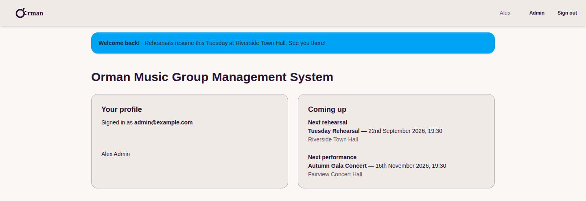
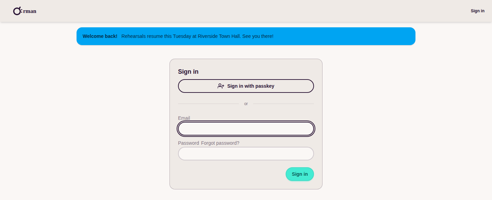
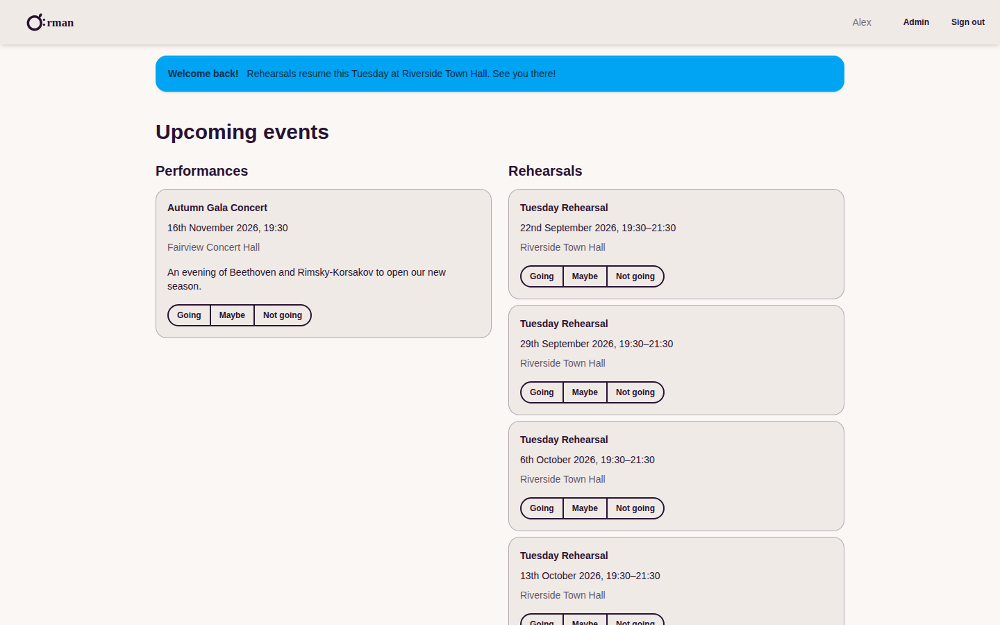
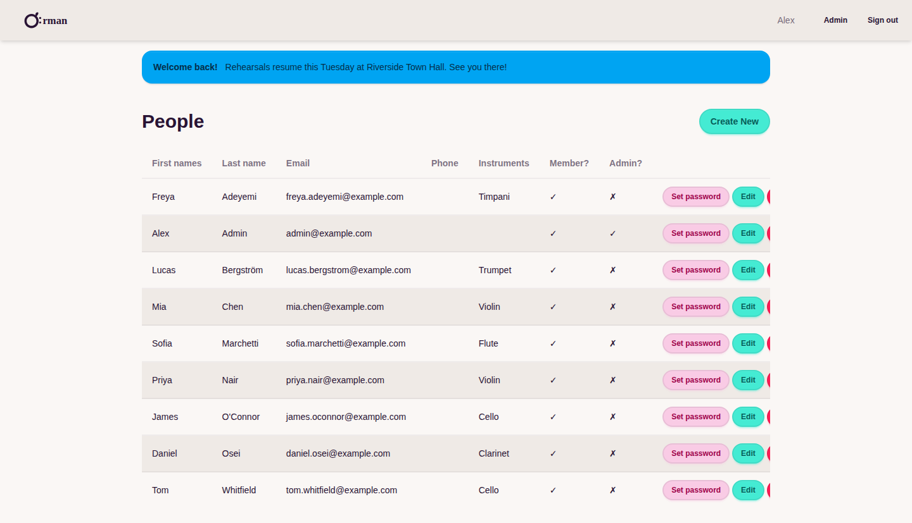
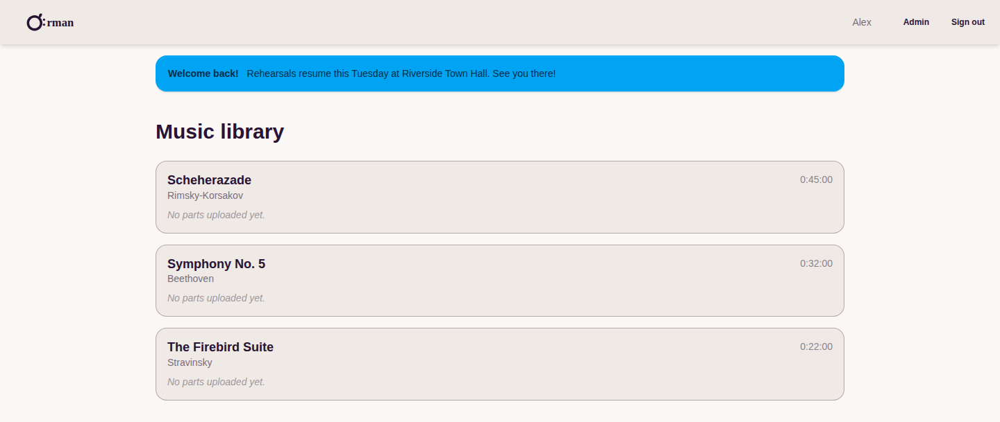
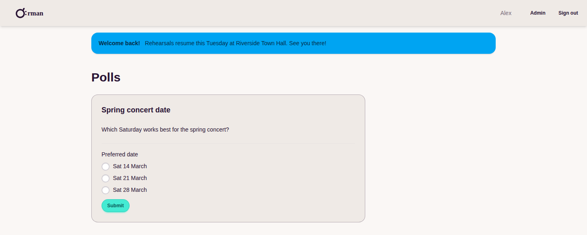

[](https://github.com/Pingue/orman/actions/workflows/ci.yml)
[](https://github.com/Pingue/orman/actions/workflows/docker_build.yml)
[](LICENSE)
[](requirements.txt)
[](requirements.txt)
[](orman/theme/static_src/package.json)

# Orman

**Orman** is self-hosted management software for amateur orchestras and music
societies — one place to run your player database, rehearsals, concerts,
music library and committee polls, instead of juggling spreadsheets and
email threads.

## Screenshots

| | |
|---|---|
| **Home** — at-a-glance next rehearsal & performance | **Sign in** — email/password or passkey (WebAuthn) |
|  |  |
| **Events** — upcoming rehearsals & performances with one-click RSVP | **Members** — admin roster with inline editing |
|  |  |
| **Music library** — repertoire with durations & parts | **Polls** — gather availability or preferences from members |
|  |  |

## Features

- **Player database** — contact details, instruments played, member vs.
  external/dep status, passkey (WebAuthn) sign-in alongside email/password.
- **Rehearsals & performances** — recurring rehearsal series with
  auto-generated dates, venues, repertoire ordering, and per-event RSVPs.
- **Music library** — pieces, composers, durations, rental contract
  tracking, and file/link uploads for parts and full scores per instrument.
- **Polls** — free-text, single- or multi-choice questions for scheduling
  concerts or gathering committee decisions.
- **Announcements** — dismissible, severity-coloured banners with optional
  scheduling windows.
- **Mailing lists** — manual or dynamically-filtered (by instrument,
  section, or all active members) lists with sync status tracking.
- **Home page & calendar** — admin-editable public homepage content and
  carousel, plus a per-member private iCal feed of upcoming events.
- **MCP server** — a bearer-token-authenticated `/mcp/` endpoint exposing
  admin operations as MCP tools, so an LLM agent can manage the roster,
  rehearsals, or repertoire on a member's behalf.

## Tech stack

- [Django](https://www.djangoproject.com/) 4.2 (Python 3.11+), SQLite
- [Tailwind CSS 4](https://tailwindcss.com/) + [DaisyUI 5](https://daisyui.com/) via [django-tailwind](https://github.com/timonweb/django-tailwind)
- [django-allauth](https://allauth.org/) for authentication, [webauthn](https://pypi.org/project/webauthn/) for passkeys
- Single-container Docker image (multi-stage: Node builds CSS, Python serves via gunicorn + whitenoise)

## Running it

The intended way to run Orman is the published Docker image with Docker Compose.

```bash
cp .env.example .env
# edit .env — SECRET_KEY at minimum

docker compose up -d
```

The app is then available at `http://localhost:8000`. Create an admin account with:

```bash
docker compose exec web python manage.py createsuperuser
```

See [`compose.yml`](compose.yml) for local/testing use and
[`compose.production.yml`](compose.production.yml) for a production
deployment with Traefik (automatic HTTPS via Let's Encrypt) and Watchtower
(automatic image updates).

### Local development

```bash
python -m venv .venv && source .venv/bin/activate
pip install -r requirements.txt

cd orman/theme/static_src
npm ci && npm run build   # compiles Tailwind CSS once; `npm run dev` watches
cd ../../..

cd orman
export SECRET_KEY=dev-secret-key
python manage.py migrate
python manage.py createsuperuser
python manage.py runserver
```

## Configuration

All configuration is via environment variables — see
[`.env.example`](.env.example) for the full list (required values, email
backend options, and production-only settings like `DOMAIN` and
`ACME_EMAIL`).

## Project requirements / ideas

The list below is the original project brief and backlog — some of it is
built (see **Features** above), the rest is where the project is headed.

* Player Database.
    * List of possible instruments/voices.
    * Contact details.
    * External players/deps contacts.

* Library Database.
    * List of pieces owned.
    * Storage location.
    * PDFs if available?.

* Rental Database.
    * List of pieces/equipment rented from where, return date, cost etc.
    * Possibly rentals out?***

* Venue Database.
    * Address.
    * Parking.
    * Contact details.

* Rehearsal Database
    * Venue.
    * Time.
        * Option for recurring with different rehearsal orders?
    * Map to library/rentals.
        * Rehearsal Order.

* Performance Database
    * Include templating option for similar concerts***
    * Time, venue, repertoire, rehearsal/performance order, description, "don't forget to bring".
    * Positions required, seating plan (optional).
    * Positions to player map (optional).
    * Map to rentals/library.
    * Extra players used (costs?)***

* Member Tools
    * Poll for ideal concert dates (given options)
    * General ongoing availability tracker (small band gigs)
    * Download my (or other) parts if PDFs available

* Committee Tools
    * Poll for meeting dates
    * Committee meeting
        * Details
        * Agenda
        * Minutes
            * Action assignment
                * Member mark as completed with datestamp?
    * Policy documents
        * Member signoff?
    * Concert planning
        * Link to performance item
        * Template for todo items
            * Action assignment
                * Member mark as completed with datestamp?
        * Wrapup/review checklist with notes / lessons learned
    * Track part distribution (optional name against part) / returns

* Plugin System
    * Accommodation Plugin
        * Track rooms required
        * Track nights required
        * Accommodation location
        * Costs
        * Room charging to players
        * Room shares

* Ideas
    * Misc contact management (libraries/external fixers/other related orchestras)
    * CSV exports of main tables (esp member list and library)
    * Import/Export to nice format

## License

[GNU AGPLv3](LICENSE)
